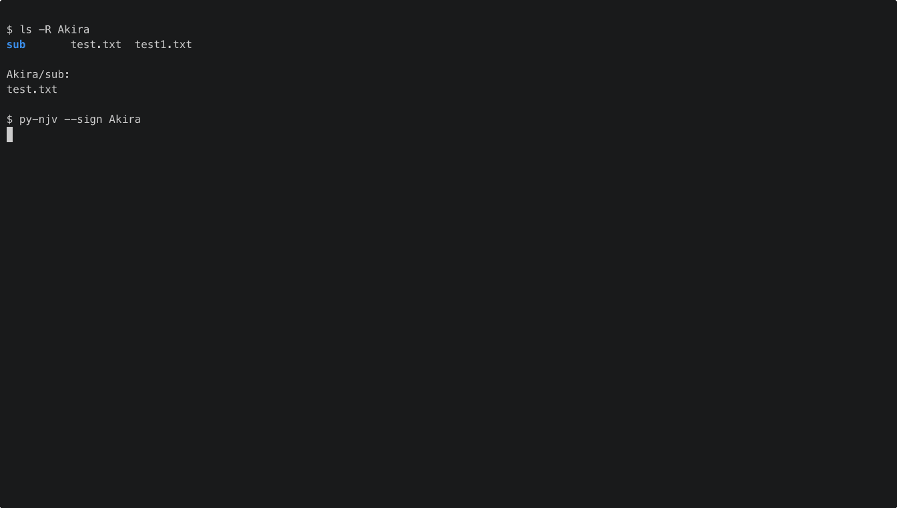

# py-ninja-vault

Recursive directory encryption, decryption, signing, and verification with GnuPG.

`py-njv` walks a directory tree and applies GPG operations to each file while skipping hidden files and folders.

## Demo

Add your animated GIF at `assets/py-ninja-vault-demo.gif` and it will be rendered here:



## Features

- Recursive encrypt/decrypt/sign/verify operations
- Hidden paths are ignored by default
- `--dry-run` to preview operations safely
- `--no-delete` to keep source files
- Optional key override from CLI (`-K`, `-D`)
- Optional alternate GPG home (`-g`, `-u`)
- Progress bars for long operations

## Installation

```bash
pip install .
```

## Compatibility

- Recommended: GnuPG 2.x
- Supported on Linux, BSD, and macOS when `gpg` is available in `PATH`
- GnuPG 1.x may work for some operations, but is not officially supported
- `gpgconf` is optional: if missing, agent reload is skipped automatically

## Configuration

Create `~/.py_njvrc`:

```ini
[DEFAULT]
UseKey=YOUR_KEY_ID
```

If you use `-D/--Default-key`, `py-njv` reads `default-key` from `~/.gnupg/gpg.conf`.

## Quick Start

Encrypt a folder:

```bash
py-njv -e <dir>
```

Decrypt a folder:

```bash
py-njv -d <dir>
```

Sign files in a folder:

```bash
py-njv --sign <dir>
```

Verify signatures:

```bash
py-njv --verify <dir>
```

## CLI Options

| Option | Description |
|---|---|
| `-e`, `--encrypt <dir>` | Recursively encrypt files in directory |
| `-d`, `--decrypt <dir>` | Recursively decrypt `.gpg` files in directory |
| `--sign <dir>` | Recursively create detached `.sig` signatures |
| `--verify <dir>` | Recursively verify `.sig` signatures |
| `-K`, `--Key-id <id>` | Use a specific GPG key id/pattern |
| `-D`, `--Default-key` | Use `default-key` from `~/.gnupg/gpg.conf` |
| `-g`, `--gnupg-dir <dir>` | Use alternate home directory containing `.gnupg` and `.py_njvrc` |
| `-u`, `--user-homedir <dir>` | Alias of `--gnupg-dir` |
| `--no-delete` | Keep source files after encrypt/decrypt |
| `--dry-run` | Preview actions without modifying files |
| `--verbose` | Verbose per-file output |
| `-V`, `--Version` | Print version |
| `-h`, `--help` | Show help |

## Security Notes

- By default, source files are removed after successful encrypt/decrypt.
- File removal uses regular filesystem deletion (not secure wipe).
- Use `--dry-run` before running on sensitive directories.

## Development

Run tests:

```bash
python -m pytest ninja_vault/tests/test_njv.py -v
```

